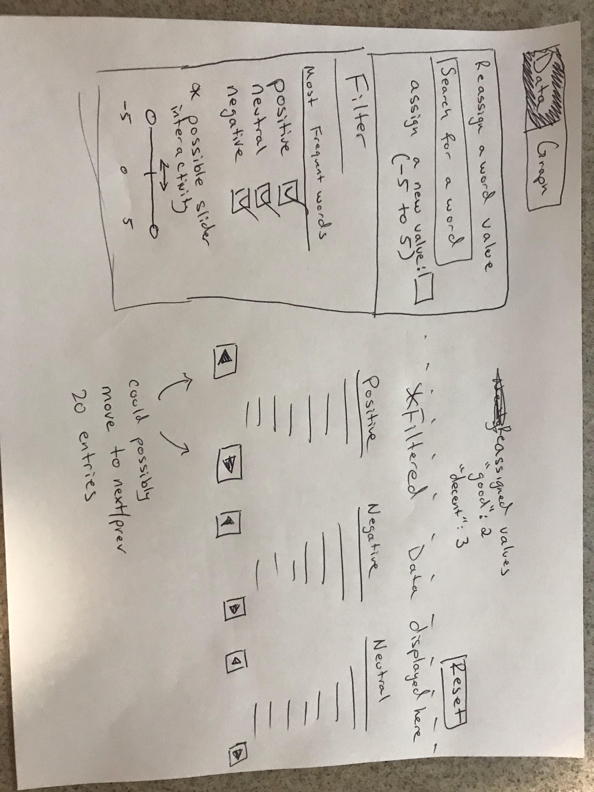
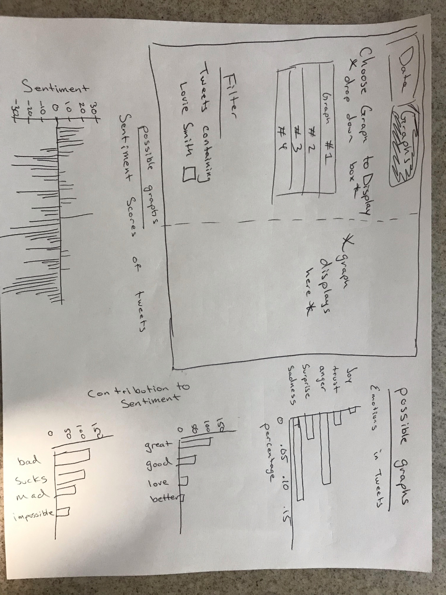

```{r set-options, include = FALSE}
# Sets default chunk options
knitr::opts_chunk$set(
  # Figures/Images will be centered
  fig.align = "center", 
  # Code will not be displayed unless `echo = TRUE` is set for a chunk
  echo = FALSE,
  # Messages are suppressed
  message = FALSE,
  # Warnings are suppressed
  warning = FALSE
)
```

```{r install-and-load-packages, include = FALSE}
# All packages needed should be loaded in this chunk
pkg_list = c('knitr', 'kableExtra', 'magrittr','rvest')

# Determine what packages are NOT installed already.
to_install_pkgs = pkg_list[!(pkg_list %in% installed.packages()[,"Package"])]

# Install the missing packages
if(length(to_install_pkgs)) {
  install.packages(to_install_pkgs, repos = "https://cloud.r-project.org")
}

# Load all packages
sapply(pkg_list, require, character.only = TRUE)
```


\newpage

# Introduction

The topic we are addressing is sentiment analysis on live Fighting Illini Tweets. The idea is to analyze live tweets with sentiment analysis in order to further understand people's reactions to the Fighting Illini and Coach Lovie's performance.   
  
Lovie Smith has previous ties to the state of Illinois from his head coaching tenure for the Chicago Bears; he was a very splashy hire back in 2016 and expectations were high coming in. So far, the Illini football program has found little success and the sentiment around Lovie seems to be changing. There are articles written about this topic including Chicago Sun Times publishing an article that talks about Lovie Smith's Job security. People are speculating that he will be done after a 4th season if there isn't improvements as there hasn't been any in the past 3 seasons. The current generation of students at Illinois probably remembers Lovie for being the coach that led the Bears to their second ever Super Bowl in 2006 so it is interesting see what kind of reactions fans are tweeting about him now that he is struggling to revive the university's football program. If the struggles continue, there is an expectation that he will be replaced.  
  
The topic came from just naturally being in our school and personal environments. Whether it is going to class  or watching the game with friends, students and fans do not wish our football team was this bad. Given his previous success with the Chicago Bears up north, we hoped Lovie Smith would be the change needed. After seeing little to no improvement, we wanted to confirm our suspicions that students and fans are as displeased with the team on twitter as they are in the conversations we hear. There seemed to be a buffer period in his first few seasons where fans gave him the benefit of the doubt, as he was getting used to the college scene, but we have a feeling that period may be over and fans' patience are wearing thin.   
  
We plan on extracting live tweets and matching words/portions with positive/negative/neutral words. From this, we are able to determine if if each individual extracted tweet is overall positive/negative/neutral, by assigning positive words ranging from 1 to 5, negative words ranging from -1 to -5, and neutral words to 0, and finding the overall sum. Ultimately, we want to apply the extracted tweet, the sentiment analysis, as well as diagnostic plots into an interactable shiny app to determine overall reactions to the team and coach.   
  
Our ultimate goal is to determine the overall fanbase opinion on the team and Lovie. We plan on using bar plots that highlight the occurrences of certain keywords and/or feelings. We are also considering creating a wordgraph that increases/decreases the size of particular words based on occurence. At the end, we plan on creating an RShiny app that will be interactive, allowing the user to look at requested graphs with drop down boxes that allow for variation when choosing which words to plot on our graphs, as well as which graphs we want to produce or hide. 
  
Upon further discussion, we determined one of the better methods of implementing our findings into a Shiny app, would be to split the data into two columns, one for NAME, and the other for the associated SCORE. We noticed that problems arise as the values in our package, were predefined by some person, or some group of people. However, everyone is different, and feel different about certain words. For example, if we have 'decent' as one of the words, some may associate it as being positive, while others may associate it as being negative. To fix this, we came up with a couple methods:
  1.Implement a drop down menu, set the default scores as the scores from the package, but offer
  a user input that allows the user to select certain words, and assign different values to them
  (that differ from whatever the package scores list them as). 
  2.Provide the top 50 words from the package dictionary, but only display 10 at a time, with
  'next' button that allows the user to move from page to page in order to avoid clutter in the
  drop down menu.
  
Sentiment Analysis requires an understanding of Regex. The reason for this, is to identify patterns, and using these patterns to extract specific portions of tweets that we would like to analyze. Furthermore, Regex helps us also to split and mutate certain tweets, that can further be compared to our positive, negative, and neutral words.
  
We also will be applying more recent topics, such as RShiny, that allows for interactive sliders and drop down menus that will assist the user in choosing exactly what they want to display. In our case, we will have options to graph specific plots (i.e bar plots) as well as specific words that we would want to appear along the x and/or y axes of our plots.
  
# Related Work

We plan on using the information within the Text Mining with R book written by Julia Silge and David Robinson. In the book they show how to use the tidytext package which contains several sentiment lexicons within the 'sentiments' dataset. There are three general-purpose lexicons contained in the 'sentiments' package which are 'AFINN', 'bing' and 'nrc'. We plan on using 'AFINN' and 'nrc' of the lexicons as 'bing'  can be considered a more specific lexicon of 'AFINN'. This will be necessary as these are essentially dictionaries of words pre-categorized which will lead to more precise data than if we were to create a dictionary on our own. 

# Methods

We plan on using the packages listed:
* "Tidytext"
* "ggplot2"
* "Rvest"
* "Tidyr"
* "dplyr"
* "twitteR"
* "stringr"
  
In order to run sentiment analysis, we will first need to collect the data set. This will involve using the twitter API along with the "twitteR" package to web scrape the data. Now, we will have a string of text containing what the tweet was. From there, we can use the "stringr" package and split the tweet into individual words, along with omitting some of the data like special characters, emojis, and hashtags. After that has been completed, we will need to organize it with "Tidyr" and "dplyr" in order to begin using the "Tidytext" package to run the sentiment analysis. Finally, we will create an RShiny app to display our graphs made with "ggplot2". 


To create the RShiny App, we will need two main tabs. One will serve as a "Data" section, and the other will be "Visualizations/Graphs". The "Data" section can be referenced in Figure 1 in the appendix. It will have a menu on the left that will allow a user to search for a word and assign its value if the users' opinion differs from the lexicon. The words that the user has reassigned its values will be displayed to the right of the section, along with a reset button to erase user input. Below that will be a "Filter" section that for right now will only filter the most frequent words. That information will be displayed to the right of the filter section. You can divide the data even further than that by displaying positive, neutral, and negative words (default is all 3). We are considering implementing a slider which you can then further filter words, i.e. instead of positive values, you can now only show positive values 3 to 5. 


In the "Visualization/Graphs" section users will be able select a graph to display from the dropdown menu. The graph will display to the right. Possible graphs include emotions in tweets, contribution of sentiment, and sentiment scores of tweets. 


# Feasibility

The **Feasibility** section is meant to act as a way to reflect upon the proposal.
Generally speaking, there will be three weeks of heavy development time afforded
to the group. Building a detailed ecosystem or heavily scripting in a different
language will likely not lead your team to success. Hence, please provide
a project management overview of *who* on your team will be doing *what* and *when*
by answering:

- Is this project able to be completed before the end of the semester?
- What steps must occur to complete the project before the end of the semester?
- What is the work plan to accomplish the necessary tasks before the end of the
  semester?
  - Specify who is doing what and when.
  - Consider making a [Gantt chart](https://en.wikipedia.org/wiki/Gantt_chart)
    to highlight each stage of the project.

# Conclusion

To summarize, our objective is to use sentiment analysis of UIUC football tweets, to determine the overall reactions from the fan base over the performance of the Fighting Illini and Coach Lovie Smith. Because our project is an implementation of sentiment analysis, our goal is to simply analyze fan base reactions, determining if the people are positive or negative about the overall football season, rather than identifying a problem. However, our project helps to identify how the Fighting Illini and Coach Lovie are performing by analyzing a score that indicates positive or negative reactions. That being said, if required to identify a problem, it would be that the Fighting Illini/Coach Lovie have been underperforming, despite Lovie's NFL coaching experience and unfortunately, a solution may be to potentially release Coach Lovie Smith. 

\newpage

# Appendix

## Example Data

```{r echo = FALSE, out.width = "200px"}
# Advance Twitter Search for tweets for Iowa game that "@"-ed Illinifootball twitter
tweets_illinifootball = read_html("https://twitter.com/search?l=&q=%40illinifootball%20OR%20%40loviesmith%20since%3A2018-11-17%20until%3A2018-11-18&src=typd")
# Scraping the data for the text within the tweet
tweets = tweets_illinifootball %>% 
  html_nodes("div.js-tweet-text-container > p") %>% 
  html_text()
# Displaying the Tweets
tweets
```

These were some of the tweets regarding the last game against Iowa where the Illini lost 63 - 0. As you can see some of the tweets already show disdain against Lovie Smith and the team. Fans are embarrassed and some are saying they will not renew season tickets until the defensive coordinator is fired. We will categorize the data for sentiment analysis putting the words in the tweets into categories such as "anger", "negative", "positive", "fear", "trust", etc. By breaking down the tweets like this we will get a better understanding of the meaning of each tweet without having to manually go through each one and decipher them. 


```{r data-tab,out.extra='angle=90',fig.cap = "Example RShiny App; Data Section", fig.pos = 'H', out.width = "350px"}

```


```{r graph-tab,out.extra='angle=90',fig.cap = "Example RShiny App; Graph Section", fig.pos = 'H', out.width = "350px"}

```


# References

https://www.tidytextmining.com/sentiment.html
@TextMiningR2016Silge{,
title = {tidytext: Text Mining and Analysis Using Tidy Data Principles in R},
author = {Julia Silge and David Robinson},
doi = {10.21105/joss.00037},
url = {http://dx.doi.org/10.21105/joss.00037},
year = {2016},
publisher = {The Open Journal},
volume = {1},
number = {3},
journal = {JOSS},
}


http://bogdanrau.com/blog/collecting-tweets-using-r-and-the-twitter-search-api/
@CollectingTweetsAPI2014Rau{rau_2014, 
title={Collecting Tweets Using R and the Twitter Search API}, url={http://bogdanrau.com/blog/collecting-tweets-using-r-and-the-twitter-search-api/}, journal={Bogdan Rau, MPH}, 
author={Rau, Bogdan}, 
year={2014}, 
month={Aug}
}

http://dataaspirant.com/2018/03/22/twitter-sentiment-analysis-using-r/
@TwitterSentimentAnalysis2018Sagar{ sagar_2018, 
title={Twitter Sentiment analysis using R}, url={http://dataaspirant.com/2018/03/22/twitter-sentiment-analysis-using-r/}, journal={Dataaspirant}, 
author={ Sagar, Chaitanya}, 
year={2018}, 
month={Mar}
}

https://chicago.suntimes.com/sports/lovie-smith-illinois-illini-northwestern-wildcats/
@Illini2018Greenberg{greenberg_2018, 
title={Is Lovie Smith done at Illinois? No, but 63-0 signals the end is inevitable}, url={https://chicago.suntimes.com/sports/lovie-smith-illinois-illini-northwestern-wildcats/}, 
journal={Chicago Sun-Times}, 
publisher={Chicago Sun-Times}, 
author={Greenberg, Steve}, 
year={2018}, 
month={Nov}
}

https://newsok.com/article/5613773/smith-an-nfl-winner-hasnt-won-at-illinois
@LovieHotseat2018Tramel{tramel_2018, 
title={Coach on the hot seat: Illinois' Lovie Smith}, url={https://newsok.com/article/5613773/smith-an-nfl-winner-hasnt-won-at-illinois}, journal={NewsOK.com}, 
publisher={NewsOK}, 
author={Tramel, Berry}, 
year={2018}, 
month={Nov}
}
